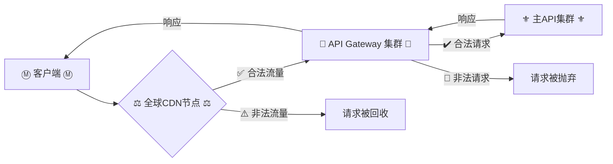

# 🍵 TEA-api-docs

**📖 茶社区开发者接口文档 | 用心沏好每一杯API**

---

## 📜 接口标准

---

## 🚀 项目介绍
**🎓 为【茶】社区开发者提供的标准化接口文档中心。** 
> 🌸 本API系统采用智能熔断机制，如遇突发巨大异常流量将自动暂停对外开放。

---

## ⚡️ 接口流程

---

## 🔒 限流策略
| 限制类型 | 阈值 | 触发保护 |
| :-----| :----: | :----: |
| 频率限制 | 2次/秒 | HTTP响应200 `返回code 404` |
| 并发连接数 | 5个/IP | 冻结该IP请求30秒 |
| 全局QPS | 根据负载动态调整 | 触发熔断机制 |

---

## 🌱 贡献指南
**🔕 本项目不接受任何PR。**

---

## ☕️ 联系我们
- 📮 API支持邮箱: ambr0se@qq.com
- 💬 联系服主: 3376108382
